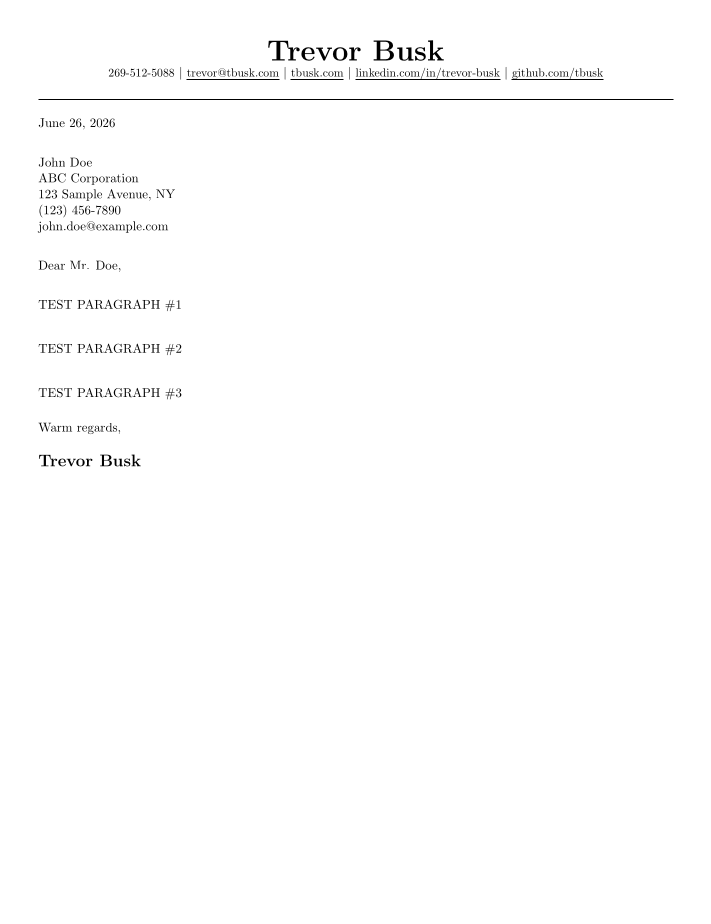

# LaTeX Software Engineer Cover Letter

This is a cover letter template I created with my twist that is:

- Single-page
- One column
- Made up of modular components, of which the underlying details are abstracted

## Preview



## Getting Started

To get started, you can add things to the document starting between the `begin` and the `end` portions.

```latex
\begin{document}
    % anything you want
\end{document}
```

### Building

To build the PDF, you will need to install `texlive` and build using `latexmk`.

You likely will need to install dependencies, but on the Solus Linux Distrobution, you only need `texlive` and
`latexmk`.

You can build a PDF without keeping the extra output files using the following command:

```shell
latexmk -pdf CoverLetter.tex && latexmk -c
```

This first half will build the pdf and the rest will clean up the extra files.

### Header

The header is the topmost item in the cover letter.

It contains your phone number, email address, website, LinkedIn, and GitHub links. Add or remove items as necessary from
the original component.

```latex
\rHeader
```

### Variables

The document uses variables to simplify the experience.

Your contact details and socials:

- `\myName{}`: Your Full Name
- `\myPhoneNumberCondensed{}`: Your phone number in a condensed format (e.g., 1234567890)
- `\myPhoneNumberPretty{}`: Your phone number in a pretty format (e.g., (123) 456-7890)
- `\myEmailAddress{}`: Your email address
- `\myWebsite{}`: Your website URL
- `\myLinkedIn{}`: Your LinkedIn profile URL
- `\myGitHub{}`: Your GitHub profile URL

Hiring Manager Details:

- `\hiringManagersFirstName{}`: The hiring manager's first name
- `\hiringManagersLastName{}`: The hiring manager's last name
- `\hiringManagersPrefix{}`: The hiring manager's title or prefix (e.g., Mr., Ms., Dr.)
- `\hiringManagersPhoneNumber{}`: The hiring manager's phone number
- `\hiringManagersEmailAddress{}`: The hiring manager's email address

Company Details:

- `\companyName{}`: The name of the company
- `\companyAddress{}`: The address of the company

How you want to address the hiring manager:

- `\introPrefix{}`: The prefix you want to use when addressing the hiring manager (e.g., Dear)

How you want to end the document:

- `\closing{}`: The closing line you want to use at the end (e.g., Sincerely, Warm regards, Regards)

Spacing between the items:

- `\itemSep`: Adds consistent spacing between content
- `\negativeItemSep`: Removes added spacing between content (used at end)

Spacing between the closing and your name:

- `\closingSep`

### Contact Details

This contains:

- Hiring manager name
- Company name
- Company address
- Hiring manager's phone number
- Hiring manager's email address

Sample:

```text
John Doe
ABC Corporation
123 Sample Avenue, NY
(123) 456-7890
john.doe@example.com
```

Usage:

```latex
\rContactDetails
```

### Intro Line

This contains:

- Intro Prefix
- Hiring manager prefix
- Hiring manager last name

Sample:

```text
Dear Mr. Doe,
```

Usage:

```latex
\rIntroLine
```

### Closing Line

This contains:

- Closing statement
- Your name (large and bold)

Sample:

```text
Warm regards,

My Name
```

Usage:

```latex
\rClosing
```

### Paragraph

This contains your paragraph content with spacing applied.

Usage:

```latex
\rParagraph{Text}
```

### Lists

Three types of lists are supported: bullet (filled circle), circle (unfilled circle), or empty (no circles).

#### Bullet

```latex
\rListBeginBullet

% any list items

\rListEndBullet
```

#### Circle

```latex
\rListBeginCircle

% any list items

\rListEndCircle
```

#### Empty

```latex
\rListBeginEmpty

% any list items

\rListEndEmpty

```

### List Items

#### Plain Item

This is the default item you want when you want to list something. It is just a regular list item.

This has one parameter for whatever text you want to show up in the list.

```latex
\rPlainItem{List item description}
```

### Links

You can add a link to something pretty easily

It has two parameters, the first is the full url, and the second is what the user actually sees.

```latex
\href{full url}{user-facing display}
```

### Spacing

You can add more spacing or adjust it for something pretty easily. Use either the `hspace` or `vspace` depending if you
want to add vertical or horizontal spacing.

#### Horizontal

```latex
\hspace{1pt}
```

#### Vertical

```latex
\vspace{1pt}
```

### Bolding

You can make something bold by using

```latex
\textbf{text}
```

### Italicization

You can make something italicized by using

```latex
\textit{text}
```

## Additional Resources

- [Latexmk Documentation](https://mgeier.github.io/latexmk.html)

## License

This project is licensed under the [MIT License](https://opensource.org/licenses/MIT) found [here](LICENSE).